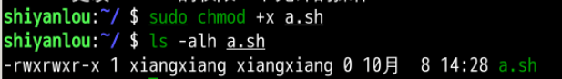
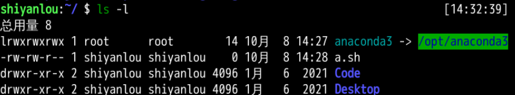
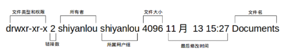
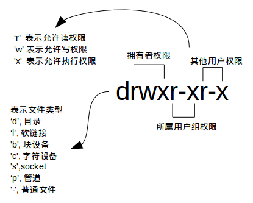
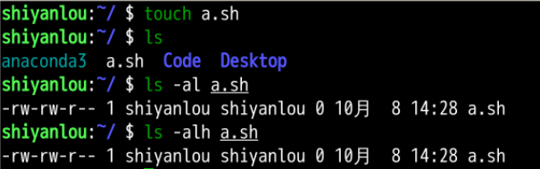
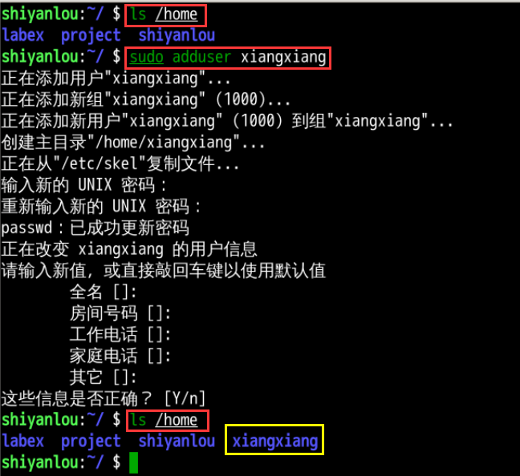
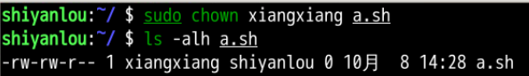
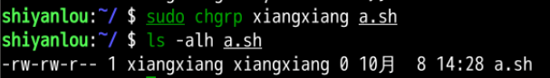

# 1. 习题说明

# 2. 熟悉 Linux（2pt, 2h）

> 2.1 如何在 Ubuntu 中安装软件（命令⾏界⾯）？它们通常被安装在什么地⽅？ 

+ 安装软件
  + `apt` 安装（Ubuntu v16+）：`sudo apt install xxx`
  + `snap` 安装（载到虚拟环境）：`sudo snap install xxx`
  + `dpkg` 安装：`sudo dpkg -i 文件名.deb`
  + 参考：https://zhuanlan.zhihu.com/p/270908077
+ 安装到位置
  + `apt` 安装 -> `/usr/bin`
  + `dpkg` 安装 -> `/opt`
+ 查找软件安装的位置
  + 用 `find` 或 `whereis/which` 命令查找文件位置 

> 2.2 linux 的环境变量是什么？我如何定义新的环境变量？ 

+ 系统环境变量详解：https://blog.csdn.net/netwalk/article/details/9455893
+ 环境变量
  + 用来指定系统运行环境的一些参数
+ 定义新的环境变量
  + `sudo gedit ~/.bashrc`
  + 输入用户密码
  + 末尾添加 `export PATH=/opt/mysoft/bin:$PATH`
    + 其中 `/opt/mysoft/bin` 为你自己需要设置的环境变量路径
+ 使其立即生效，在终端执行 `source ~/.bashrc`

> 2.3 假设我要给 a.sh 加上可执⾏权限，该输⼊什么命令？

+ 输入命令：`sudo chmod +x a.sh`

**注释一些内容**
+ 列出文件 `ls -l`

+ 上图的解释

+ 关于权限

> 2.4 假设我要将 a.sh ⽂件的所有者改成 xiang:xiang，该输⼊什么命令？

+ 首先创建 `a.sh` 这个文件，并查看当前的权限信息以及拥有者和所属用户，这里是 `shiyanlou`

+ 创建一个 `xiangxiang` 用户

+ 更改文件拥有者 `chown`

+ 更改文件的用户组 `chgrp`

# 3. SLAM 综述文献阅读（3pt, 3h）

> 3.1 SLAM 会在哪些场合中⽤到？⾄少列举三个⽅向。 

+ 增强现实
+ 自动驾驶
+ 救援任务

> 3.2 SLAM 中定位与建图是什么关系？为什么在定位的同时需要建图？

+ For being precisely localized in an environment, a correct map is necessary, but in order to construct a good map it is necessary to be properly localized when elements are added to the map.
+ 为了在环境中精确定位，需要一个正确的建图，但为了构建一个好的地图，在向地图添加元素时，需要正确的定位。

> 3.3 SLAM 发展历史如何？我们可以将它划分成哪⼏个阶段？ 

+ classical age (1986-2004)
  + the introduction of the main probabilistic formulations for SLAM
+ algorithmic-analysis age (2004-2015)
  + the study of fundamental properties of SLAM
+ nowadays

> 3.4 列举三篇在 SLAM 领域的经典⽂献。

+ [1] C. Cadena, L. Carlone, H. Carrillo, Y. Latif, D. Scaramuzza, J. Neira, I. Reid, and J. J. Leonard, “Past, present, and future of simultaneous localization and mapping: Toward the robust-perception age,” IEEE Transactions on Robotics, vol. 32, no. 6, pp. 1309–1332, 2016.
+ [2] J. Fuentes-Pacheco, J. Ruiz-Ascencio, and J. M. Rendón-Mancha, “Visual simultaneous localization and mapping: a survey,” Artificial Intelligence Review, vol. 43, no. 1, pp. 55–81, 2015.
+ [3] L. Haomin, Z. Guofeng, and B. Hujun, “A survey of monocular simultaneous localization and mapping,”Journal of Computer-Aided Design and Compute Graphics, vol. 28, no. 6, pp. 855–868, 2016. in Chinese.

# 4. CMake 练习（2pt, 1.5h）

> 4.1 include/hello.h 和 src/hello.c 构成了 libhello.so 库。hello.c 中提供⼀个函数 sayHello()，调⽤此函 数时往屏幕输出⼀⾏“HelloSLAM”。我们已经为你准备了 hello.h 和 hello.c 这两个⽂件，见“code/” ⽬录下。
> 
> 4.2 ⽂件 useHello.c 中含有⼀个 main 函数，它可以编译成⼀个可执⾏⽂件，名为“sayhello”。 
> 
> 4.3 默认⽤ Release 模式编译这个⼯程。 
> 
> 4.4 如果⽤户使⽤ sudo make install，那么将 hello.h 放⾄/usr/local/include/下，将 libhello.so 放 ⾄/usr/local/lib/下。
> s
> 请按照上述要求组织源代码⽂件，并书写 CMakeLists.txt。
 

# 5. 理解 ORB-SLAM2 框架（3pt, 2h）

# 6. 使用摄像头或视频运行 ORB-SLAM2（3pt, 1h）