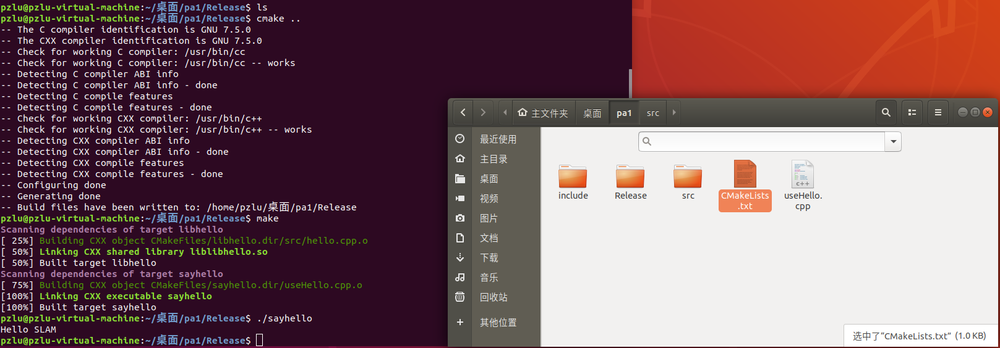
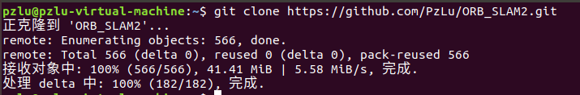
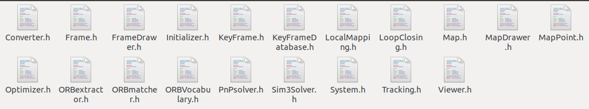
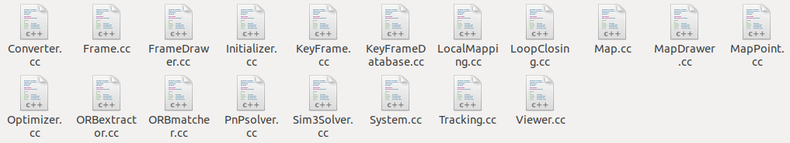
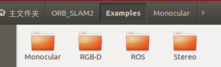

# 1. 习题说明

# 2. 熟悉 Linux（2pt, 2h）

> 2.1 如何在 Ubuntu 中安装软件（命令⾏界⾯）？它们通常被安装在什么地⽅？ 

+ 安装软件
  + `apt` 安装（Ubuntu v16+）：`sudo apt install xxx`
  + `snap` 安装（载到虚拟环境）：`sudo snap install xxx`
  + `dpkg` 安装：`sudo dpkg -i 文件名.deb`
  + 参考：https://zhuanlan.zhihu.com/p/270908077
+ 安装到位置
  + `apt` 安装 -> `/usr/bin`
  + `dpkg` 安装 -> `/opt`
+ 查找软件安装的位置
  + 用 `find` 或 `whereis/which` 命令查找文件位置 

> 2.2 linux 的环境变量是什么？我如何定义新的环境变量？ 

+ 系统环境变量详解：https://blog.csdn.net/netwalk/article/details/9455893
+ 环境变量
  + 用来指定系统运行环境的一些参数
+ 定义新的环境变量
  + `sudo gedit ~/.bashrc`
  + 输入用户密码
  + 末尾添加 `export PATH=/opt/mysoft/bin:$PATH`
    + 其中 `/opt/mysoft/bin` 为你自己需要设置的环境变量路径
+ 使其立即生效，在终端执行 `source ~/.bashrc`


> 2.3 假设我要给 a.sh 加上可执⾏权限，该输⼊什么命令？


+ 输入命令：`sudo chmod +x a.sh`


**注释一些内容**
+ 列出文件 `ls -l`


+ 上图的解释


+ 关于权限


> 2.4 假设我要将 a.sh ⽂件的所有者改成 xiang:xiang，该输⼊什么命令？

+ 首先创建 `a.sh` 这个文件，并查看当前的权限信息以及拥有者和所属用户，这里是 `shiyanlou`


+ 创建一个 `xiangxiang` 用户


+ 更改文件拥有者 `chown`


+ 更改文件的用户组 `chgrp`


# 3. SLAM 综述文献阅读（3pt, 3h）

> 3.1 SLAM 会在哪些场合中⽤到？⾄少列举三个⽅向。 

+ 增强现实
+ 自动驾驶
+ 救援任务


> 3.2 SLAM 中定位与建图是什么关系？为什么在定位的同时需要建图？

+ For being precisely localized in an environment, a correct map is necessary, but in order to construct a good map it is necessary to be properly localized when elements are added to the map.
+ 为了在环境中精确定位，需要一个正确的建图，但为了构建一个好的地图，在向地图添加元素时，需要正确的定位。

> 3.3 SLAM 发展历史如何？我们可以将它划分成哪⼏个阶段？ 

+ classical age (1986-2004)
  + the introduction of the main probabilistic formulations for SLAM
+ algorithmic-analysis age (2004-2015)
  + the study of fundamental properties of SLAM
+ nowadays

> 3.4 列举三篇在 SLAM 领域的经典⽂献。

+ [1] C. Cadena, L. Carlone, H. Carrillo, Y. Latif, D. Scaramuzza, J. Neira, I. Reid, and J. J. Leonard, “Past, present, and future of simultaneous localization and mapping: Toward the robust-perception age,” IEEE Transactions on Robotics, vol. 32, no. 6, pp. 1309–1332, 2016.
+ [2] J. Fuentes-Pacheco, J. Ruiz-Ascencio, and J. M. Rendón-Mancha, “Visual simultaneous localization and mapping: a survey,” Artificial Intelligence Review, vol. 43, no. 1, pp. 55–81, 2015.
+ [3] L. Haomin, Z. Guofeng, and B. Hujun, “A survey of monocular simultaneous localization and mapping,”Journal of Computer-Aided Design and Compute Graphics, vol. 28, no. 6, pp. 855–868, 2016. in Chinese.


# 4. CMake 练习（2pt, 1.5h）

> 4.1 include/hello.h 和 src/hello.c 构成了 libhello.so 库。hello.c 中提供⼀个函数 sayHello()，调⽤此函 数时往屏幕输出⼀⾏“HelloSLAM”。我们已经为你准备了 hello.h 和 hello.c 这两个⽂件，见“code/” ⽬录下。
> 
> 4.2 ⽂件 useHello.c 中含有⼀个 main 函数，它可以编译成⼀个可执⾏⽂件，名为“sayhello”。 
> 
> 4.3 默认⽤ Release 模式编译这个⼯程。 
> 
> 4.4 如果⽤户使⽤ sudo make install，那么将 hello.h 放⾄/usr/local/include/下，将 libhello.so 放 ⾄/usr/local/lib/下。
> 
> 请按照上述要求组织源代码⽂件，并书写 CMakeLists.txt。

## 文件树

> 更改了文件后缀名为 .cpp

```
├── CMakeLists.txt
├── include
│   └── hello.h
├── Release
├── src
│   └── hello.cpp
└── useHello.cpp
```

```cmake
#CMakeLists.txt
cmake_minimum_required(VERSION 2.7)
project(hello_slam)
############################################################
# Create a library
############################################################
#根据hello.cpp生成动态库
add_library(libhello SHARED 
    src/hello.cpp
)
#为这个库目标，添加头文件路径，PUBLIC表示包含了这个库的目标也会包含这个路径
target_include_directories(libhello
    PUBLIC 
        ${PROJECT_SOURCE_DIR}/include
)
############################################################
# Create an executable
############################################################
#根据main.cpp生成可执行文件
add_executable(sayhello
	useHello.cpp
)
#链接库和可执行文件，使用的是这个库的别名。PRIVATE 表示
target_link_libraries(sayhello
    PRIVATE 
        libhello
)
############################################################
#set release
############################################################
SET(CMAKE_BUILD_TYPE "Release")
```
## 执行截图



# 5. 理解 ORB-SLAM2 框架（3pt, 2h）

+ 下载 ORB-SLAM2
+ https://github.com/raulmur/ORB_SLAM2
  + 因为下不下来，fork 到自己的 github 上了
    + https://github.com/PzLu/ORB_SLAM2




> 5.1 ORB-SLAM2 将编译出什么结果？有⼏个库⽂件和可执⾏⽂件？

+ Release 模式编译结果
+ 库和可执行文件
  + 库文件：19（shared）+ 5 = 24个
  + 可执行文件：6个

> 5.2 ORB-SLAM2 中的 include, src, Examples 三个⽂件夹中都含有什么内容？

+ include：包含一系列头文件



+ src：包含一系列 cc 文件



+ Examples：RUNTIME_OUTPUT 文件



> 5.3 ORB-SLAM2 中的可执⾏⽂件链接到了哪些库？它们的名字是什么？

+ rgbd_tum，stereo_kitti，stereo_euroc，mono_tum，mono_kitti，mono_euroc

```bsh
# Build examples

set(CMAKE_RUNTIME_OUTPUT_DIRECTORY ${PROJECT_SOURCE_DIR}/Examples/RGB-D)

add_executable(rgbd_tum
Examples/RGB-D/rgbd_tum.cc)
target_link_libraries(rgbd_tum ${PROJECT_NAME})

set(CMAKE_RUNTIME_OUTPUT_DIRECTORY ${PROJECT_SOURCE_DIR}/Examples/Stereo)

add_executable(stereo_kitti
Examples/Stereo/stereo_kitti.cc)
target_link_libraries(stereo_kitti ${PROJECT_NAME})

add_executable(stereo_euroc
Examples/Stereo/stereo_euroc.cc)
target_link_libraries(stereo_euroc ${PROJECT_NAME})


set(CMAKE_RUNTIME_OUTPUT_DIRECTORY ${PROJECT_SOURCE_DIR}/Examples/Monocular)

add_executable(mono_tum
Examples/Monocular/mono_tum.cc)
target_link_libraries(mono_tum ${PROJECT_NAME})

add_executable(mono_kitti
Examples/Monocular/mono_kitti.cc)
target_link_libraries(mono_kitti ${PROJECT_NAME})

add_executable(mono_euroc
Examples/Monocular/mono_euroc.cc)
target_link_libraries(mono_euroc ${PROJECT_NAME})
```


# 6. *使用摄像头或视频运行 ORB-SLAM2（3pt, 1h）

+ 用的虚拟机，摄像头设置起来比较麻烦，这里视频运行 code/myvideo.mp4。


